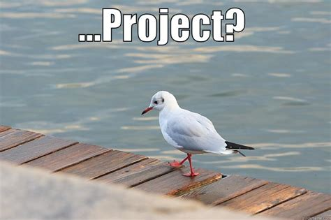

<div align="center">

# gen-readme

A readme generator. Well, trully? it just copies the template to your directory.

[](https://github.com/datsfilipe/gen-readme/stargazers)


<br/>
<br/>



<br/>
</div>

## Usage

- Install the package globally:

```bash
cargo install gen-readme
```

## How to Run the Project

1. Clone this repository: `git clone git@github.com:datsfilipe/gen-readme.git`.
2. Enter in the project directory: `cd gen-readme`.
3. Run the project: `cargo run`.

## How to Contribute

Follow these steps to contribute to the project:

1. Fork the repository.
2. Create a new branch: `git checkout -b feature-branch-name`.
3. Make your changes and commit them: `git commit -m 'Add some feature'`.
4. Push to the branch: `git push origin feature-branch-name`.
5. Open a pull request.

Please ensure that your code adheres to the project's coding standards.

## Contributors

<table>
    <tr>
        <td align="center">
            <a href="https://github.com/datsfilipe">
                <br>
                <sub>
                    <b>Filipe Lima</b>
                </sub>
            </a>
        </td>
    </tr>
</table>


## License

This project is licensed under the [License](LICENSE).
